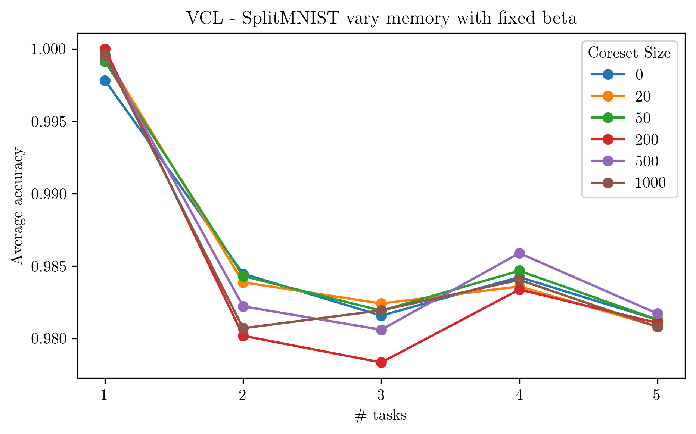

## Variational Continual Learning in PyTorch

Re-Implementation of [Variational Continual Learning](https://arxiv.org/abs/1710.10628) by  Nguyen, Li, Bui, and Turner (ICLR 2018).

### SplitMNIST: VCL v/s Baselines

### PermutedMNIST: VCL v/s Baselines

### Vary beta (Weight coefficient for KL term)
Varying beta while keeping memory fixed at 200 samples per task.

### Vary Memory
Varying memory while keeping beta fixed at 1.

### Vary Memory (Fixed prior)
Varying memory while keeping prior fixed to Gaussian distribution.

